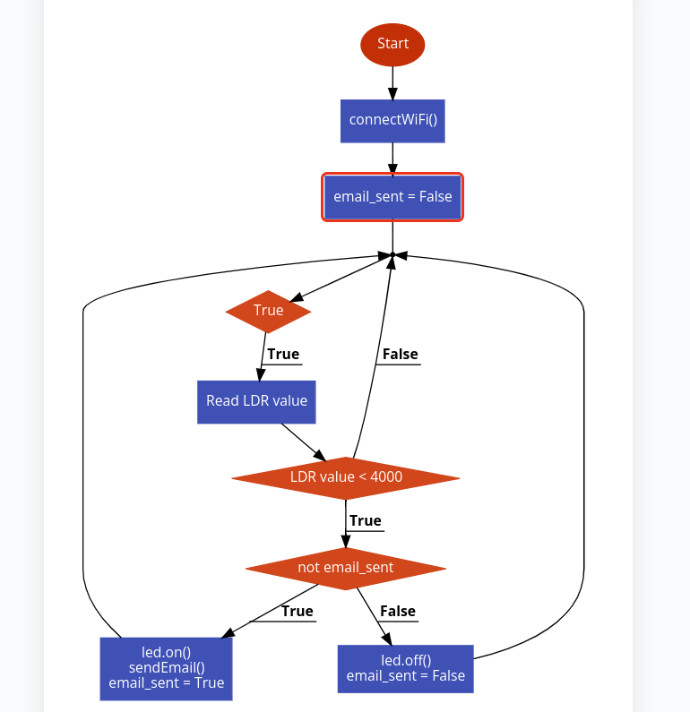

# lock-alert-notify

Un notificador de alertas no caso de apertura dunha taquilla.

## Requisitos

- [Raspberry Pi Pico W](https://www.raspberrypi.com/products/raspberry-pi-pico/)
- [MicroPython](https://micropython.org/)
- [Thonny IDE](https://thonny.org/)

## Instalación

Instalar o último _firmware_ de Raspberry Pi Pico.

## Esquema

## Pseudo código

## Sample

